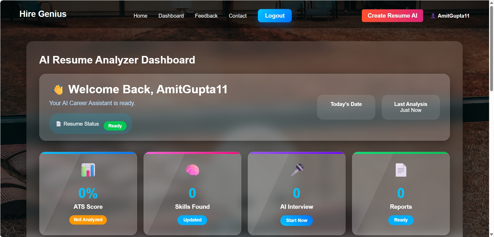
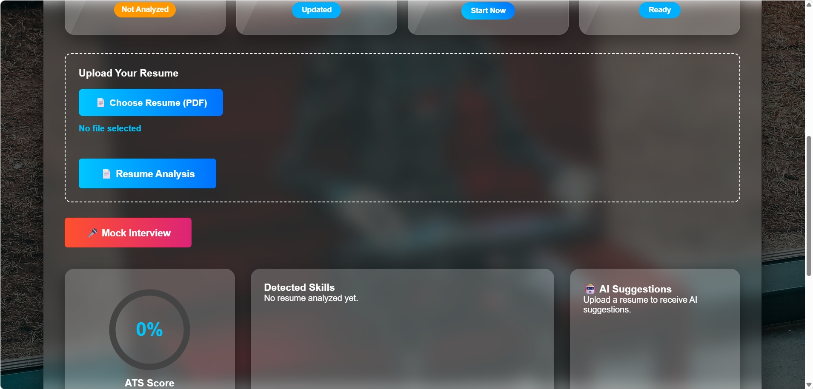
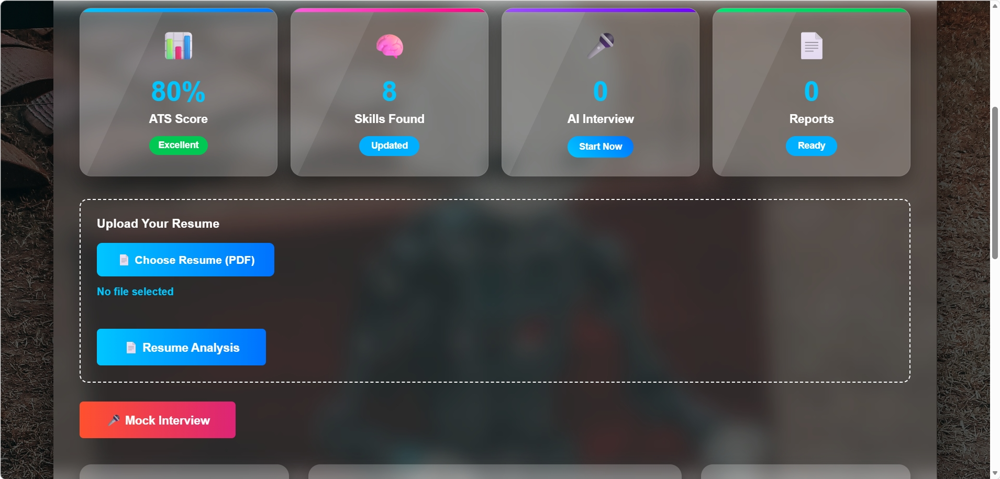
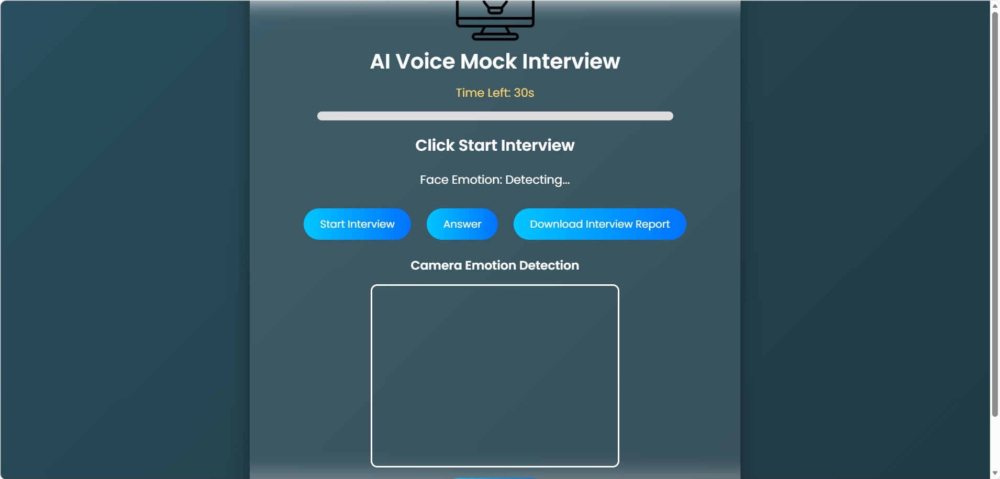

<div align="center">

# 🚀 HireGenius

### AI-Powered Resume Analyzer & Mock Interview Platform

Analyze resumes, calculate ATS scores, detect skills, receive AI suggestions, and practice mock interviews — all in one platform.


</div>

---

# 📖 About

HireGenius is an AI-powered Flask web application that helps users improve their resumes by analyzing ATS compatibility, detecting skills, generating suggestions, and providing AI-based mock interview practice.

The project aims to help students and job seekers prepare for placements and interviews through a simple and interactive web platform.

---

# ✨ Features

- 📄 Upload Resume (PDF)
- 📊 ATS Resume Score
- 🤖 AI Resume Analysis
- 💡 Resume Improvement Suggestions
- 🛠 Skill Detection
- 🎤 AI Mock Interview
- 📑 Interview Report
- 🔐 Secure Login & Signup
- 📱 Responsive Design

---

# 🛠 Tech Stack

| Technology | Used |
|------------|------|
| Python | Backend |
| Flask | Web Framework |
| HTML5 | Frontend |
| CSS3 | Styling |
| JavaScript | Client-side Logic |
| SQLite | Database |
| PyPDF2 | PDF Processing |
| ReportLab | PDF Report Generation |

---

# 📂 Project Structure

```text
Hire-Genius/
│
├── static/
│   ├── css/
│   ├── js/
│
├── templates/
│
├── uploads/
│
├── instance/
│
├── app.py
├── interview_bot.py
├── requirements.txt
└── README.md
```

---

# 🚀 Installation

### Clone Repository

```bash
git clone https://github.com/AmitGupta1101/Hire-Genius.git
```

### Open Project

```bash
cd Hire-Genius
```

### Create Virtual Environment

```bash
python -m venv venv
```

### Activate

Windows

```bash
venv\Scripts\activate
```

### Install Dependencies

```bash
pip install -r requirements.txt
```

### Run

```bash
python app.py
```

Open:

```
http://127.0.0.1:5000
```

---

# 📸 Screenshots

> Add screenshots here.

| Home | Dashboard |
|------|-----------|
|  |  |

| Resume Analysis | Interview |
|-----------------|-----------|
|  |  |

---

# 🎯 Future Enhancements

- 🔹 AI Resume Builder
- 🔹 Job Recommendation System
- 🔹 Email Notifications
- 🔹 Multiple Resume Formats
- 🔹 AI Career Guidance
- 🔹 Admin Dashboard
- 🔹 Resume History
- 🔹 Interview Analytics

---

# 🤝 Contributing

Contributions are welcome!

1. Fork the repository
2. Create a new branch
3. Commit your changes
4. Push the branch
5. Open a Pull Request

---

# 👨‍💻 Developer

**Amit Gupta**

🐙 GitHub  
https://github.com/AmitGupta1101

💼 LinkedIn  
https://www.linkedin.com/in/amit-gupta-19612b274

---

<div align="center">

### ⭐ If you like this project, don't forget to Star the repository!

Made with ❤️ by Amit Gupta

</div>